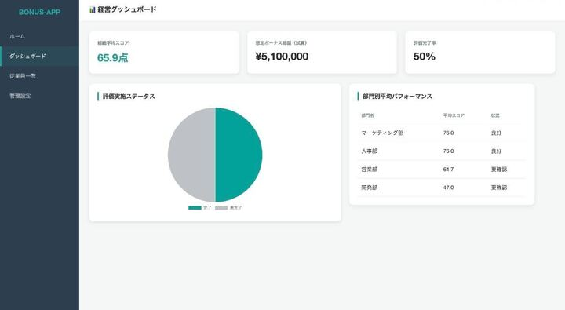
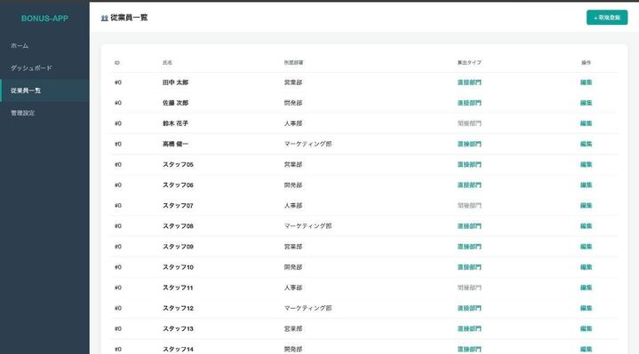
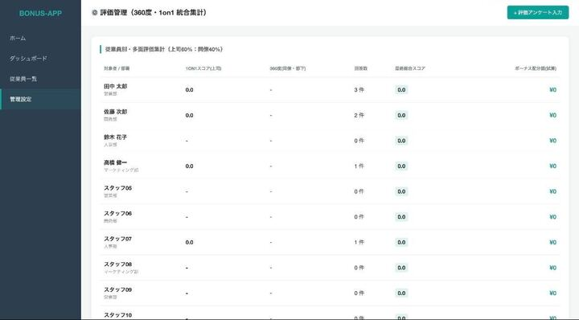
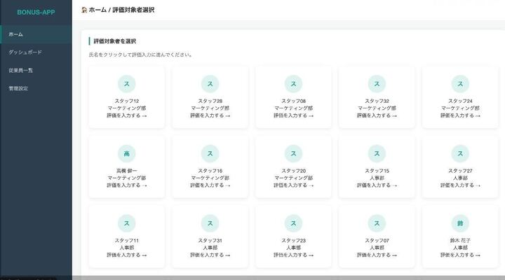
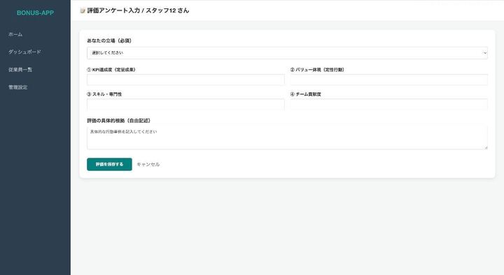

制作アプリのタイトル 
## 賞与シミュレーション・査定管理システム

### 制作アプリの説明（40文字程度） 
評価データと部門別ウェイトに基づき、賞与配分を自動計算・グラフ化するPHPアプリ

### 工夫した点・こだわった点
- 部門別の柔軟な計算ロジック：直接部門（売上重視）と間接部門（姿勢・スキル重視）で評価の重み付けを変えられるようにし、実務に即した算出

- データ連携の自動化：evaluationsテーブルの最新査定データをSQLで動的に取得し、ダッシュボードへリアルタイムに反映させる仕組み

- 直感的なUI：Chart.jsを用いて賞与配分を可視化し、経営層が一目で予算状況を把握可能

## サービス画面一覧

### 1. ダッシュボード
経営指標や評価の進捗状況をひと目で確認できます。

### 2. 従業員・評価管理
従業員の一覧表示と、各メンバーの評価集計・管理が可能です。

### 3. 評価入力フロー
対象者を選んで、スムーズに評価アンケートを入力できます。

## 次回トライしたこと（または機能）
- AI分析の高度化: 現在はエラーが出がちなAIコメント機能を、Gemini API等と安定して連携させ、査定のフィードバックを自動生成したい。

- CSV出力機能：算出した賞与配分データを、そのまま給与ソフトに取り込めるCSV形式でダウンロードできる機能。

- 評価期間（クォーター）管理
-  年度や四半期ごとに評価データを切り替えて表示・保存できる機能。

### 備考（感想、シェアしたいこと等なんでも） 
データベースの連携（カラム名の不一致）やPHPの構文エラーで真っ白な画面になるなど苦戦しました。

